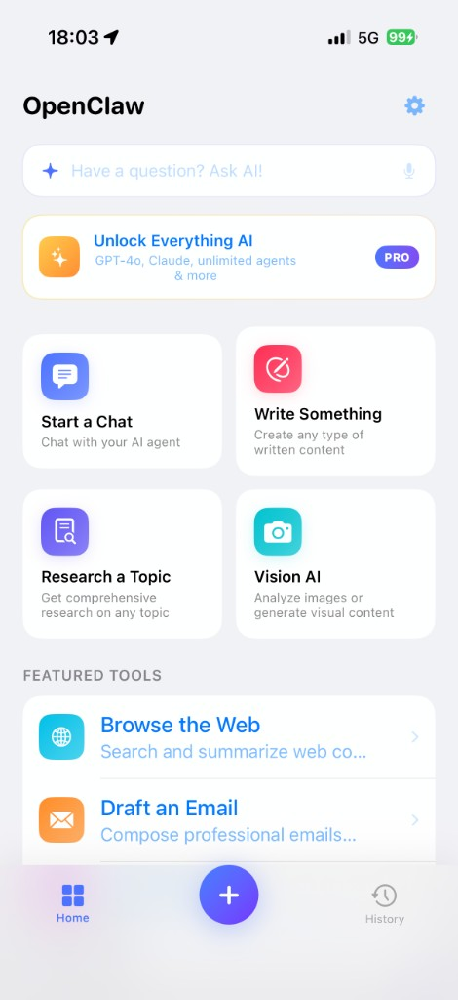
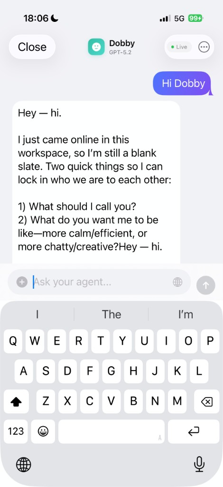
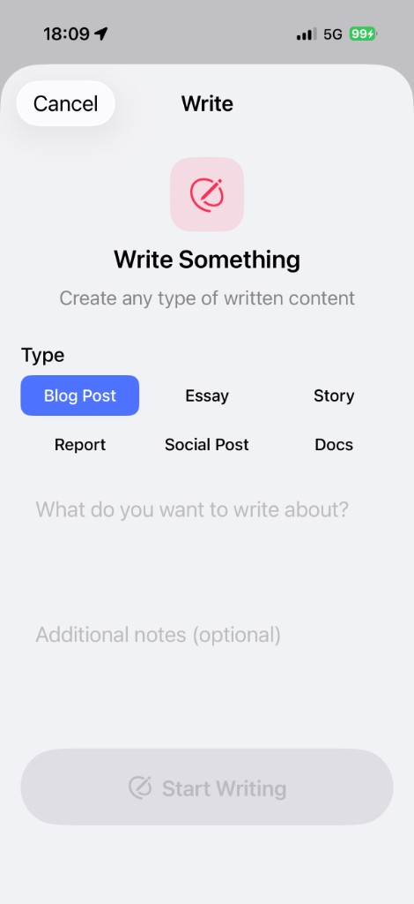
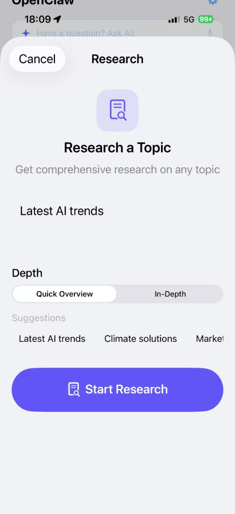

# OpenClaw iOS

A native iOS app that puts self-hosted AI agents in your pocket. Built with SwiftUI, backed by a Dockerized [OpenClaw](https://github.com/AizelNetwork/openclaw) gateway that gives each user isolated agents, skills, and streaming task execution.

## Screenshots

<p align="center">
  
  
  
  
</p>

## Architecture

```
┌──────────────────────┐        HTTPS / WSS        ┌──────────────────────────┐
│    iOS App (SwiftUI) │ ◄────────────────────────► │  API Gateway (Express)   │
│                      │                            │  :3000                   │
│  • Onboarding        │                            ├──────────────────────────┤
│  • Agent management  │                            │  BullMQ Worker           │
│  • Skill browser     │                            │  (task processor)        │
│  • Chat-style tasks  │                            ├──────────────────────────┤
│  • Paywall (StoreKit)│                            │  OpenClaw Gateway        │
└──────────────────────┘                            │  :18789 (internal)       │
                                                    ├──────────────────────────┤
                                                    │  PostgreSQL 16 + Redis 7 │
                                                    └──────────────────────────┘
```

The iOS app talks to the API Gateway over REST + WebSocket. Tasks are queued via BullMQ, executed by the worker against the OpenClaw gateway's chat completions API, and streamed back to the phone in real time via Redis pub/sub.

Each user gets an isolated OpenClaw agent with its own workspace, persona files, and auth credentials. Starter skills are auto-installed on agent creation.

For the full product specification, security model, and roadmap see [ARCHITECTURE.md](ARCHITECTURE.md).

## Prerequisites

- **macOS / Linux** host
- **Docker Desktop** (or Docker Engine + Docker Compose v2)
- **Xcode 15+** (for the iOS app)
- At least one LLM API key (OpenAI or Anthropic)

## Quick Start

### 1. Start the backend

```bash
cd backend
./setup.sh
```

Or manually:

```bash
cd backend
cp .env.example .env
# Edit .env — add your API keys
docker compose up -d
```

### 2. Add your LLM API key

Edit `backend/.env` and set at least one:

```
OPENAI_API_KEY=sk-...
ANTHROPIC_API_KEY=sk-ant-...
```

Then restart:

```bash
cd backend && docker compose up -d
```

### 3. Verify the backend

```bash
curl http://localhost:3000/health
# → {"status":"ok","services":{"database":"healthy","openclaw_gateway":"healthy"}}
```

### 4. Run the iOS app

Open `OpenClaw.xcodeproj` in Xcode, select a simulator, and run. The app connects to `http://localhost:3000` in debug mode.

See [backend/README.md](backend/README.md) for the full API reference, environment variables, and common operations.

## Project Structure

```
.
├── OpenClaw/                       # iOS app (SwiftUI + Swift 6)
│   ├── App/                        #   App entry point, ContentView
│   ├── Models/                     #   Agent, Skill, TaskItem, User, Subscription
│   ├── Services/                   #   APIClient, AuthService, AgentService, etc.
│   ├── Views/                      #   Onboarding, Home, Skills, Tasks, Paywall
│   └── Utilities/                  #   Constants, Keychain, AppTheme
│
├── backend/                        # Dockerized backend (8 services)
│   ├── docker-compose.yml          #   caddy, config-init, onboard, api-gateway,
│   │                               #   worker, openclaw-gateway, postgres, redis
│   ├── setup.sh                    #   One-command deployment
│   ├── api-gateway/                #   Express.js API server
│   ├── db/init.sql                 #   PostgreSQL schema
│   ├── openclaw/                   #   OpenClaw upstream (built locally)
│   └── openclaw-config/            #   Base gateway configuration
│
├── screenshots/                    # App screenshots
└── ARCHITECTURE.md                 # Full product & architecture spec
```

## Tech Stack

| Layer         | Technology                   |
| ------------- | ---------------------------- |
| iOS App       | SwiftUI, Swift 6, StoreKit 2 |
| Networking    | URLSession + async/await     |
| Backend API   | Express.js (Node.js 22)      |
| Task Queue    | BullMQ + Redis 7             |
| Database      | PostgreSQL 16 (RLS)          |
| AI Engine     | OpenClaw (self-hosted)       |
| Reverse Proxy | Caddy (auto-TLS)             |
| Containers    | Docker Compose               |

## License

Private. See [ARCHITECTURE.md](ARCHITECTURE.md) for the full product specification.
